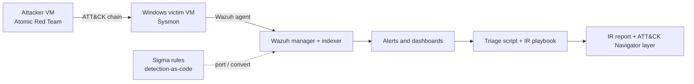

# Purple Team Detection Lab

An end-to-end SOC Tier 3 exercise in a home lab: **emulate an ATT&CK-mapped attack chain, detect it with detection-as-code (Sigma), hunt what the rules miss, respond with a playbook, and report like a real incident.**

> **Status: scaffold complete, lab results not recorded yet.**
> Rules, attack plan, tooling, playbook and report template are in place and pass the local validation checks in `tools/`.
> Every attack step is still `planned` in [`attack/plan.yaml`](attack/plan.yaml). Nothing in this repo claims a detection has been verified until a step is marked `detected` after a real run.

## Goal

Show the Tier 3 loop, not just alert triage:

1. **Emulate** a realistic intrusion chain safely, inside an isolated lab.
2. **Detect** each technique with a portable Sigma rule, measure what fires and what is missed.
3. **Hunt** for the techniques the rules miss, with written hypotheses and queries.
4. **Respond** using a playbook, then write an incident report with a timeline.
5. **Measure** coverage with an ATT&CK Navigator layer that separates *rule written* from *verified in lab*.

## Architecture



Set-up notes are in [`lab/README.md`](lab/README.md).

## Attack chain

| Step | Tactic | Technique | Detection rule(s) | Lab status |
|------|--------|-----------|-------------------|------------|
| S1 | Execution | T1204.002 User Execution | `proc_creation_win_office_spawn_shell` | planned |
| S2 | Execution | T1059.001 PowerShell | `proc_creation_win_powershell_encoded_command` | planned |
| S3 | Defense Evasion | T1218.005 Mshta | `proc_creation_win_mshta_remote_or_script` | planned |
| S4 | Command and Control | T1105 Ingress Tool Transfer | `proc_creation_win_certutil_download` | planned |
| S5 | Credential Access | T1003.001 LSASS Memory | `proc_creation_win_rundll32_comsvcs_minidump`, `proc_access_win_lsass_suspicious_access` | planned |
| S6 | Persistence | T1547.001 Registry Run Keys | `registry_set_win_run_key_persistence` | planned |
| S7 | Persistence | T1053.005 Scheduled Task | `proc_creation_win_schtasks_persistence` | planned |
| S8 | Lateral Movement | T1021.002 SMB/Admin Shares | `proc_creation_win_net_use_admin_share` | planned |
| S9 | Defense Evasion | T1070.001 Clear Event Logs | `proc_creation_win_evtlog_clear` | planned |

## Repository layout

```
attack/plan.yaml          attack steps, expected telemetry, linked rules, lab status
detections/sigma/         Sigma rules (source of truth)
detections/wazuh/         example of porting a rule to a Wazuh custom rule
hunts/                    threat-hunting hypotheses and queries
playbooks/                incident response playbook (credential dumping)
automation/               alert triage script + synthetic sample alert
tools/attack_coverage.py  coverage table, validation (CI) and ATT&CK Navigator layer
tools/validate_sigma.py   parses every rule with the official pySigma parser
ci/                       GitHub Actions workflow (copy to .github/workflows/)
reports/                  IR report template and generated Navigator layer
lab/                      lab build notes
```

## Quick start

```bash
pip install -r requirements.txt
python tools/attack_coverage.py                                   # coverage table
python tools/attack_coverage.py --check                           # validate rules and plan
python tools/validate_sigma.py                                    # parse rules with pySigma
python tools/attack_coverage.py --layer reports/attack-navigator-layer.json
python automation/triage_alert.py automation/samples/wazuh_alert_lsass_dump.json
```

Import the generated layer into [ATT&CK Navigator](https://mitre-attack.github.io/attack-navigator/) to see the coverage map.
A GitHub Actions workflow that runs the validation and the triage smoke test on every push is provided in [`ci/validate.yml`](ci/validate.yml).
Copy it to `.github/workflows/validate.yml` to enable it (pushing workflow files needs a token with the `workflow` scope, or use the GitHub web UI).

## Workflow after you run the lab

1. Run a step (see `atomic:` in the plan), record what alerted in Wazuh.
2. Set the step `status` to `detected` or `missed` in [`attack/plan.yaml`](attack/plan.yaml) and add `notes`.
3. For every `missed` step, add a rule under `detections/sigma/` or a hunt under `hunts/`.
4. Regenerate the Navigator layer, then write the incident report from [`reports/ir-report-template.md`](reports/ir-report-template.md).

## Skills demonstrated

| Tier 3 skill | Where |
|--------------|-------|
| Detection engineering (detection-as-code, tuning notes, CI validation) | `detections/`, `tools/`, `ci/` |
| Threat hunting (hypotheses, data sources, queries) | `hunts/` |
| Incident response (playbook, containment, eradication, recovery) | `playbooks/`, `reports/` |
| Threat intelligence and ATT&CK mapping | `attack/plan.yaml`, Navigator layer |
| Automation (alert enrichment and triage) | `automation/triage_alert.py` |

## Results

| Metric | Value |
|--------|-------|
| Steps executed | 0 / 9 (not run yet) |
| Steps detected | not measured |
| Steps missed | not measured |
| Mean time to detect | not measured |

Update this table from the lab runs. Do not fill it with estimates.

## Safety and scope

- Run every attack step only on **your own isolated lab VMs** (host-only or internal network, no route to production or the internet during tests). Take snapshots first.
- Use test accounts only. Never point these techniques at systems you do not own or have written permission to test.
- No employer data, internal hostnames, real logs or customer information belong in this repository.

## References

[MITRE ATT&CK](https://attack.mitre.org/) ·
[Sigma](https://github.com/SigmaHQ/sigma) ·
[Atomic Red Team](https://github.com/redcanaryco/atomic-red-team) ·
[Wazuh documentation](https://documentation.wazuh.com/) ·
[NIST SP 800-61](https://csrc.nist.gov/pubs/sp/800/61/r2/final)
